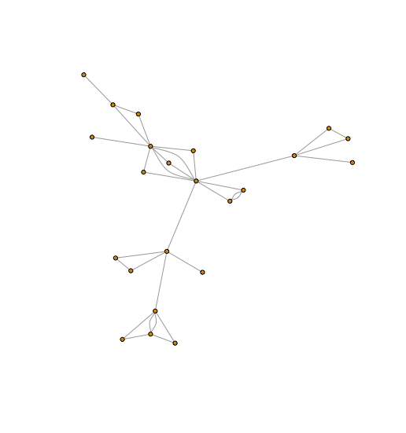

# Fiber-Sampling-Using-Reinforcement-Learning

The code in this repo is for the paper: "Learning to sample fibers for goodness-of-fit testing". (https://arxiv.org/abs/2405.13950)

We consider the problem of constructing exact goodness-of-fit tests for discrete exponential family models. This classical problem remains practically unsolved for many types of structured or sparse data, as it rests on a computationally difficult core task: to produce a reliable sample from lattice points in a high-dimensional polytope. We translate the problem into a Markov decision process and demonstrate a reinforcement learning approach for learning `good moves' for sampling. We illustrate the approach on data sets and models for which traditional MCMC samplers converge too slowly due to problem size, sparsity structure, and the requirement to use prohibitive non-linear algebra computations in the process. The differentiating factor is the use of scalable tools from \emph{linear} algebra in the context of theoretical guarantees provided by \emph{non-linear} algebra. Our algorithm is based on an actor-critic sampling scheme, with provable convergence.
The discovered moves can be used to efficiently obtain an exchangeable sample, significantly cutting computational times with regards to statistical testing.

